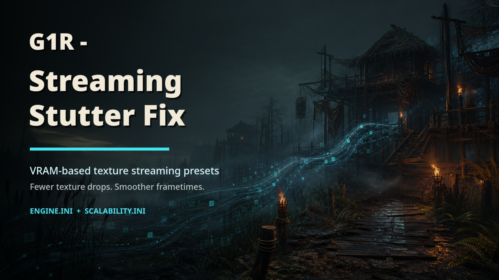

# G1R - Streaming Stutter Fix

VRAM-based texture streaming presets for Gothic 1 Remake.

This mod raises the Unreal Engine texture streaming pool based on your GPU VRAM
and adds conservative shader/loading tweaks. It is intended to reduce texture
pop-in, streaming pressure and frametime drops without lowering Lumen, Nanite,
shadow quality, view distance, resolution or texture quality.



## What It Changes

Gothic 1 Remake ships with very small texture streaming pools in its default
scalability profiles:

```text
TextureQuality@0     200 MB
TextureQuality@1     300 MB
TextureQuality@2     400 MB
TextureQuality@3     500 MB
TextureQuality@Cine  1000 MB (Overdose in the game menu)
```

Many users play with Texture Quality Overdose. Internally, that maps to
`sg.TextureQuality=4` and `TextureQuality@Cine`.
That means the default texture streaming pool can be only `1000 MB`, even on
modern GPUs with much more VRAM.

This project provides `Engine.ini` and `Scalability.ini` presets that raise that
pool in a controlled, VRAM-based way.

## Desktop App

The repository now includes an early Tauri/Rust desktop app in `app/`.

The app wraps the same presets with a safer workflow:

- detects common Windows and Linux/Proton config folders
- previews the selected preset before writing files
- backs up existing `Engine.ini` and `Scalability.ini`
- installs the selected preset
- can opt into balanced Scalability.ini performance tweaks
- can opt into Game.ini tweaks such as skipping intro videos
- restores backups created by the app

The optimizer core lives in `optimizer-core/` and is intentionally separate from
the Tauri UI so it can also become a CLI later.

Development commands:

```bash
cargo test -p optimizer-core
cd app
npm install
npm run dev
```

Build commands:

```bash
cd app
npm run build
```

The Tauri bundle includes the repository `Presets/` directory as an app resource.
See `docs/desktop-app.md` for architecture notes.

## Presets

```text
4 GB VRAM   -> 1536 MB
6 GB VRAM   -> 3072 MB
8 GB VRAM   -> 4096 MB
10 GB VRAM  -> 5120 MB
12 GB VRAM  -> 6144 MB
16 GB VRAM  -> 8192 MB
20 GB VRAM  -> 10240 MB
24 GB VRAM  -> 12288 MB
```

If streaming stutter remains and your VRAM usage has several GB of headroom, try
one preset higher. If you see crashes, new long hitches or VRAM usage close to
the GPU limit, use one preset lower.

## Installation

1. Close Gothic 1 Remake completely.
2. Open the config folder:

   ```text
   %LOCALAPPDATA%\G1R\Saved\Config\Windows\
   ```

   Linux / Proton example:

   ```text
   <SteamLibrary>/steamapps/compatdata/1297900/pfx/drive_c/users/steamuser/AppData/Local/G1R/Saved/Config/Windows/
   ```

3. Back up existing `Engine.ini` and `Scalability.ini` if they exist.
4. Pick the preset matching your GPU VRAM.
5. Copy `Engine.ini` and `Scalability.ini` from that preset folder into the config folder.
6. Set `Engine.ini` and `Scalability.ini` to read-only. This prevents the game from
   removing or rewriting them on launch.
7. Launch and test.

## Notes

This is mainly a stutter/frametime/streaming fix, not a guaranteed average FPS
mod. Average FPS can improve if the game was limited by streaming pressure, but
the main goal is smoother gameplay.

The desktop app includes an optional `Balanced Performance Tweaks` switch. It is
off by default and only adds conservative `Scalability.ini` caps for the Overdose
profile; it does not write `GameUserSettings.ini` or disable Lumen, Nanite or
virtual shadows. The app labels this as `Overdose only` because the current tweak
set does not target the lower scalability profiles.

The `Game Tweaks` page includes an optional `Skip Intro Videos` switch. It
writes `Game.ini` to remove startup logo/legal movies from the startup loading
screen list while keeping the engine loading screen, so the game reaches the
menu without an extra click. It does not delete, overwrite, or rename original
video files.

`r.MotionBlurQuality=0` is included because many users disable motion blur in
the menu, while the engine profile behind Overdose can still set engine-side
motion blur quality. Remove that line from `Engine.ini` if you want engine-side
motion blur.

No `GameUserSettings.ini` is included. Resolution, fullscreen mode, frame limit
and normal in-game quality sliders remain under user control.

## Tested Setup

The initial tuning was tested on:

```text
CPU: AMD Ryzen 7 9800X3D
GPU: Radeon RX 7900 XT 20 GB
Resolution: 2560x1440
OS/runtime: Linux + Steam Proton
```

On that setup, the `20GB_VRAM_10240MB` preset noticeably reduced drops and made
the Swamp Camp area feel smoother.
